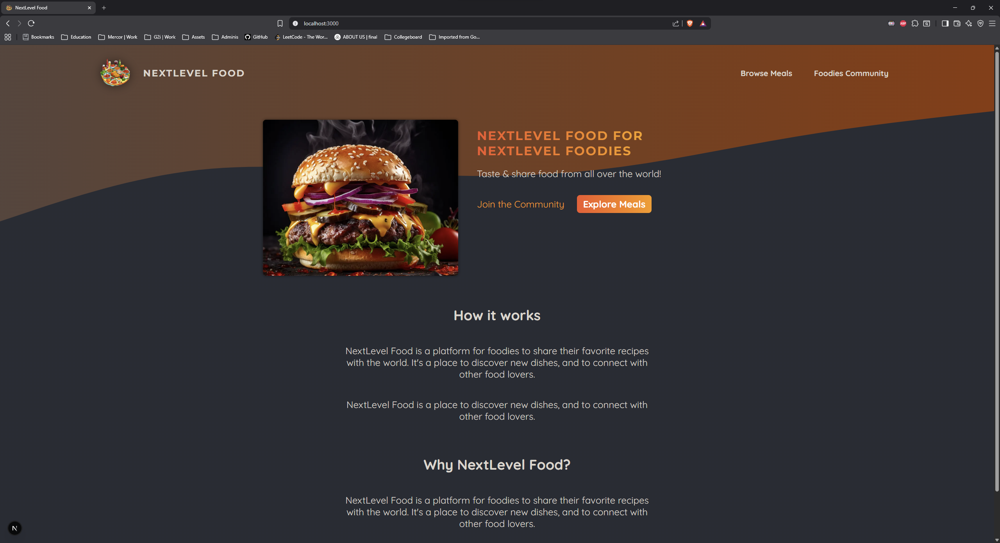
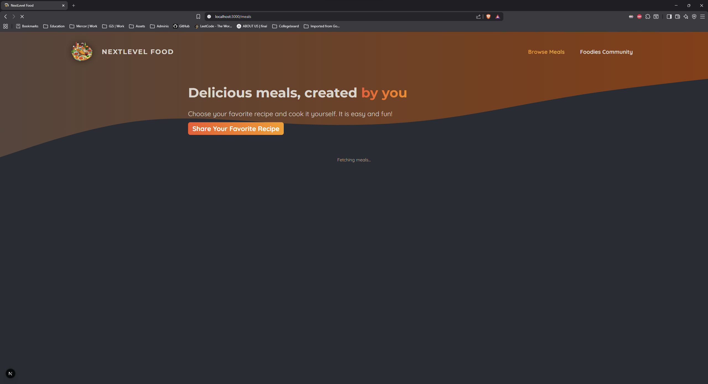
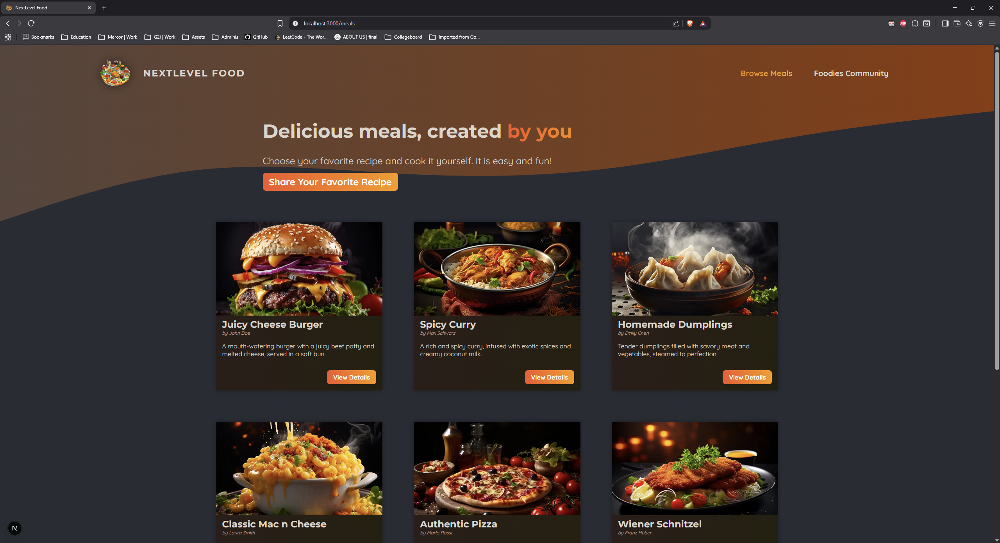
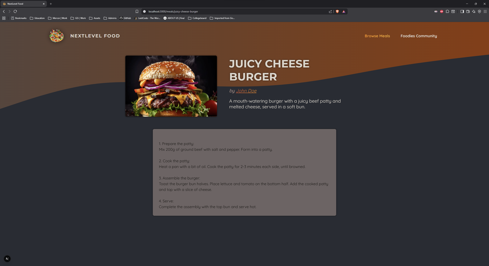
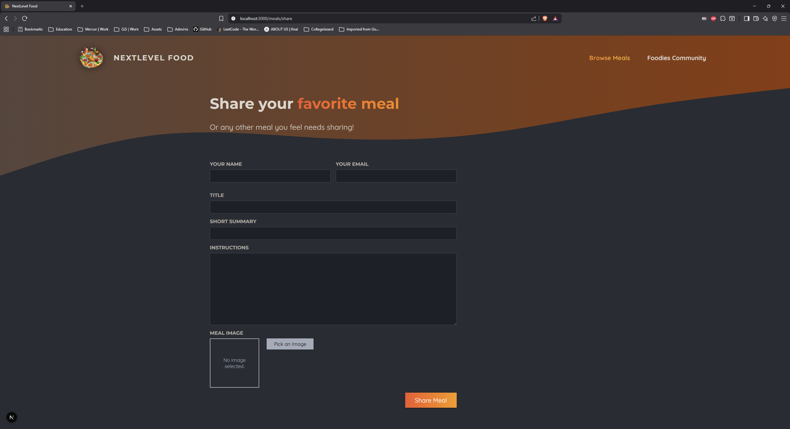
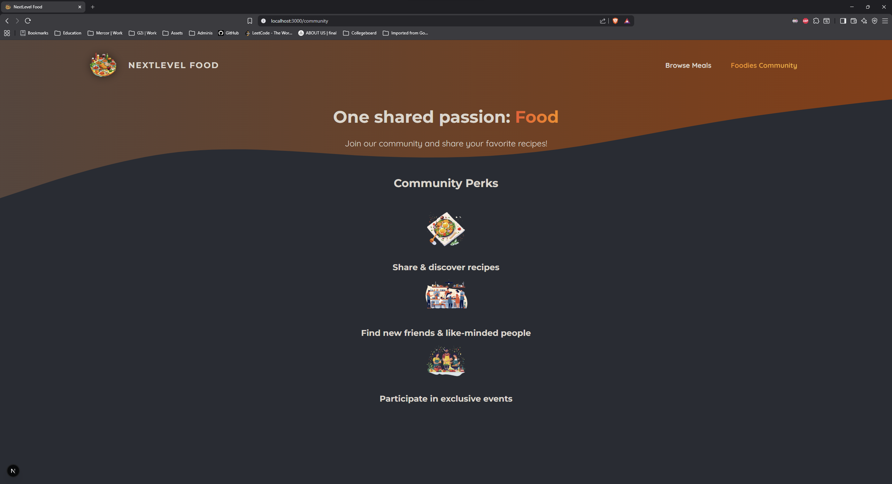

## Food Website made in NextJS

To launch, pull repo and npm install
Run "node initdb.js" to initialize local database

Note, a local mock db and locally stored image files are used, this will not be valid in production.
In production AWS deployment would be more standard, at the very least storing images in an S3 bucket.

## Screenshots

